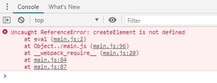

# 简易 Toy-React 框架实现

## Day 1

### 前置准备

- 配置 `Webpack`
- 配置 `babel-loader`
- 配置 `@babel/preset-env` 和 `@babel/plugin-transform-react-jsx`


**注：** 其中关键插件为 `plugin-transform-react-jsx` , 它用于将 `JSX` 语法转换为 `createElement` 函数（`babel` 插件允许传递参数改变函数名）的调用。

### 1. JSX 语法转换

以下代码片段，运行 `npx webpack` 指令

```js
let divElements = <div id='a' class='b'>
  <div></div>
  <div></div>
</div>
```

编译生成后代码如下，然而 `chrome devtools` 会报错误: `createElement` 函数未定义

```js
var divElements = createElement("div", {
  id: "a",
  "class": "b"
}, createElement("div", null), createElement("div", null));
```




### 2. 实现 `createElement` 函数

**因此我们的重心转变为实现 `createElement` 函数**

基本上，我们需要处理的是 `HTML` 标签和属性的设置，调用 `DOM` 原有操作 `API` 即可实现在 `Javascript` 代码里写 `HTML`, 简易实现如下：

```js
function createElement(tagName, attributes, ...children) {
  let elm = document.createElement(tagName);
  for (let p in attributes) {
    elm.setAttribute(p, attributes[p]);
  }
  for (let child of children) {
    if (typeof child === 'string') {
      child = document.createTextNode(child);
    }
    elm.appendChild(child);
  }
  return elm;
}
```

### 3. `createElement` 函数兼容自定义组件转换

`React` 的 `JSX createElement` 语法是可以同时兼容原生 `DOM` 元素和自定义组件（例如：`MyComponent`）转换的

以下代码片段，运行 `npx webpack` 指令

```js
let components = <div id='a' class='b'>
  <MyComponent />
</div>
```

编译生成后代码如下

```js
var components = createElement("div", {
  id: "a",
  "class": "b"
}, createElement(MyComponent, null));
```

由此可见，`createElement` 函数的第一个参数可能为 [`DOMString`](https://developer.mozilla.org/zh-CN/docs/Web/API/DOMString) 字符串，也可能为自定义的组件**变量**，通常在 `React` 里自定义组件是一个类，对照得我们可以抽象出下面的伪代码


```js
import { createElement, Component, render } from './toy-react.js';

class MyComponent extends Component {
  render() {
    return (
      <div></div>
    );
  }
}

let app = <div>
  <MyComponent>
</div>;

render(app, document.body);
```

下一步，我们实现的就是原生 `DOM` 和自定义组件的统一类封装，以及提升我们 `createElement` 函数的能力。


## Day 2

> 为了自定义组件、原生 `DOM` 操作接口统一，我们进行相应的封装

* `ElementWrapper` - 元素节点封装类

```js
class ElementWrapper {
  constructor(type) {
    this.root = document.createElement(type)
  }
  setAttribute(name, value){
    this.root.setAttribute(name, value)
  }
  appendChild(component) {
    this.root.appendChild(component.root)
  }
}

class TextElementWrapper {
  constructor(content) {
    this.root = document.createTextNode(content)
  }
}
```


* `TextElementWrapper` - 文本节点封装类

```js
class TextElementWrapper {
  constructor(content) {
    this.root = document.createTextNode(content)
  }
}
```

* `Component` - 自定义组件基类


```js
export class Component {
  constructor() {
    this._root = null
    this.props = Object.create(null)
    this.children = []
  }
  setAttribute(name, value) {
    this.props[name] = value
  }
  appendChild(child) {
    this.children.push(child)
  }

  get root () {
    if (this._root === null) {
      this._root = this.render().root // 核心实现，Component 嵌套会递归调用 render
      for (let p in this.props) {
        initAttributes(this._root, p, this.props[p])
      }
    }
    return this._root
  }
}
```

* 其他核心函数

```js
export function createElement(type, attributes, ...children) {
  let el;
  if (typeof type === 'string') {
    el = new ElementWrapper(type)
  } else {
    el = new type
  }

  for (let p in attributes) {
    el.setAttribute(p, attributes[p])
  }

  function insertChildren (children) { // 递归插入子项
    for (let child of children) {
      if (typeof child === 'string') {
        child = new TextElementWrapper(child)
      }
      if (typeof child === 'object' && child instanceof Array) {
        insertChildren(child)
      } else {
        el.appendChild(child)
      }
    }
  }

  insertChildren(children)

  return el;
}


export function render (component, parentElement) {
  parentElement.appendChild(component.root)
}
```

### [Range API](https://developer.mozilla.org/zh-CN/docs/Web/API/Range)

> 可以看到上面我们只是对 `DOM` 的操作进行了简单的封装

假设 `main.js` 入口文件是这样

```js
import { createElement, Component, render } from './toy-react.js'

class MyComponent extends Component {
  constructor () {
    super()
    this.state = {
      a: 1,
      b: 2
    }
  }

  render () {
    return <div>
      <button onClick={() => { this.setState({ a: this.state.a+1 }) }}></button>
      {this.state.a.toString()}
      {this.state.b.toString()}
    </div>
  }
}


render(<MyComponent>, document.body)
```

参考 `React` 实现，我们需要解决的问题是：`state` 数据更新后，视图如何同步渲染；为了提高操作 `DOM` 的便利性，我们引入 `Range` 进行 `DOM` 的重新绘制


### `rerender` 与合并 `state`

```js
const RENDER_TO_DOM = Symbol('renderToDom')

export class Component {
  constructor() {
    this._root = null
    this.props = Object.create(null)
    this.children = []
    this._range = null
  }
  setAttribute(name, value) {
    this.props[name] = value
  }
  appendChild(child) {
    this.children.push(child)
  }

  // 合并 merge
  setState(newState) {
    if (this.state === null) {
      this.state = newState
      this.rerender()
      return
    }

    let merge = (oldState, newState) => {
      for (let p in newState) {
        if (oldState[p] === null || typeof oldState[p] !== 'object') {
          oldState[p] = newState[p]
        } else {
          merge(oldState[p], newState[p])
        }
      }
    }
    merge(this.state, newState)
    this.rerender()
  }

  // 通过 range 渲染 DOM
  [RENDER_TO_DOM](range) {
    this._range = range
    this.render()[RENDER_TO_DOM](range)
  }

  rerender() {
    let oldRange = this._range
    let range = document.createRange()

    range.setStart(oldRange.startContainer, oldRange.startOffset)
    range.setEnd(oldRange.startContainer, oldRange.startOffset)
    this[RENDER_TO_DOM](range)

    oldRange.setStart(range.endContainer, range.endOffset)
    oldRange.deleteContents()
  }
}
```

`ElementWrapper`、`TextElementWrapper` ...等也需要做对应的修改

```js
class ElementWrapper {
  // ...

  appendChild(component) {
    let range = document.createRange()
    range.setStart(this.root, this.root.childNodes.length)
    range.setEnd(this.root, this.root.childNodes.length)
    range.deleteContents()
    component[RENDER_TO_DOM](range)
  }

  [RENDER_TO_DOM](range) {
    range.deleteContents()
    range.insertNode(this.root)
  }
}

class TextElementWrapper {
  // ...

  [RENDER_TO_DOM](range) {
    range.deleteContents()
    range.insertNode(this.root)
  }
}

export function render (component, parentElement) {
  let range = document.createRange()
  range.setStart(parentElement, 0)
  range.setEnd(parentElement, parentElement.childNodes.length)
  range.deleteContents()
  component[RENDER_TO_DOM](range)
}
```

### 到达这一步就可以使用我们的 `toy-react` 去运行 `React` 官方教程 `tic-tac-toe` 了

运行成果图：

